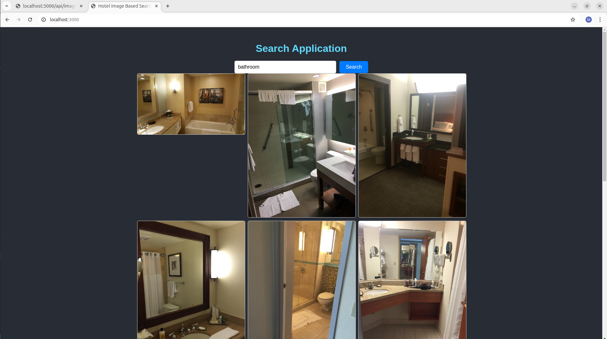

# hotel_ibs

## Step 1: Getting data
Download training images from https://github.com/GWUvision/Hotels-50K/ (execute download_train.py).

Problems: dataset is huge (1,027,871 images from 50,000 hotels, and 92 major hotel chains) so that takes a lot of time. For the prototyping phase I had to download only part of it.

## Step 2: 
create_database.py
Create PostgreSQL database 'hotel_ibs' with tables:
- hotel
- chain
- images
  
Problems: again, the dataset is huge so I had to only create part of the entries.

## Step 3: Tag images
tag_images.py
Get tags with OpenAI CLIP
- install OpenAI CLIP
-  git clone https://github.com/openai/CLIP.git
-  cd CLIP
-  pip install -r requirements.txt
-  pip install .
- run images through OpenAI CLIP
- save tags to relevant image_id 

Problems:
- the current implementation that I found, I have to create the tags myself, they are not auto-generated from an internal Clip dictionary as I had thought.
- the larger the size of the tags dictionary, the more memory CLIP takes to tag the image. my computer was quickly running out of memory for dictionaries above 200 words. For dictionaries at 200 words it took 30s per image so I decided to move it to a Google Colab session to use T4 GPUs. 

## Step 4: Create Flask backend and fetch information from Postgres database and images from AWS S3
I already had a backend from another project and just had to make minor adjustements

## Step 5: Create React frontend
I already had a frontend from another project and just had to make minor adjustements.
There is a text box and a button "Search".

## Step 6: Connect frontend and backend
When page is loaded, information from database is downloaded.
When user clicks the button search, the tags are searched for the text in the textbox. If images are tagged with this search item they are downloaded from the AWS S3 bucket and displayed. The images are cached to diminish download time in the future.

This is the first working state of the application:

